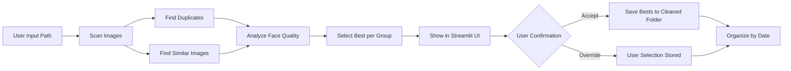

# Photo Cleaner App with AI-Powered Duplicate Detection

A smart photo organization tool that scans, deduplicates, and organizes your images using AI for best-shot selection. Includes an interactive Streamlit frontend for reviewing and refining duplicates.

---

## 📂 Features

* Remove exact and similar-looking duplicates using perceptual hashing
* Automatically select the best image from duplicates based on face quality (eyes open, smiles, etc.)
* Organize images into folders by date (from EXIF)
* Streamlit frontend to review duplicates
* Manual override: visually select preferred photo from each duplicate group
* CR2, RAW, HEIC, and other formats supported

---

## 📸 Example Workflow

1. **User selects a photo folder**
2. **Pipeline scans images recursively**
3. **Duplicates & similar images are grouped**
4. **AI analyzes expressions, sharpness, and lighting**
5. **Best image is chosen & highlighted**
6. **User reviews in Streamlit UI**
7. **Organized into date folders & saved**

---

## 🧠 Architecture



---

## ⚙️ Setup Instructions

### ✅ Prerequisites

* Python 3.9 to 3.11 (avoid 3.13 due to some library incompatibility)
* Git installed
* Recommended: Virtual Environment

### 📦 Installation

```bash
# Clone the repository
git clone https://github.com/YOUR_USERNAME/photo-cleaner.git
cd photo-cleaner

# Set up virtual environment
python -m venv venv
source venv/bin/activate   # or .\venv\Scripts\activate on Windows

# Install dependencies
pip install -r requirements.txt
```

---

## 🖥️ Running the App

### Backend (CLI mode)

```bash
python main.py
```

### Streamlit Frontend

```bash
streamlit run frontend/app.py
```

---

## 📁 Folder Structure

```
photo-cleaner/
├── backend/
│   ├── scanner.py
│   ├── duplicate_detector.py
│   ├── face_quality.py
│   ├── organizer.py
│   └── utils.py
├── frontend/
│   └── app.py
├── main.py
├── requirements.txt
└── README.md
```

---

## 🧪 Sample Use Case

* Folder: `D:/New folder/All Photos`
* Output: `D:/New folder/All Photos/CleanedPhotos`
* Duplicate folder: `CleanedPhotos/BestDuplicates`
* Similar folder: `CleanedPhotos/BestSimilar`

You can review each group and confirm whether to keep the AI-selected image or override manually.

---

## 🛠️ Tech Stack

* Python
* OpenCV
* Pillow
* imagehash
* Streamlit
* tqdm
* RawImageReader (for CR2, NEF, ARW)
* Custom logic for face expression ranking using face landmarks (MediaPipe alt)

---

## 🧠 How It Picks the Best Image

Each group is ranked by these heuristics:

* Eyes open > closed
* Smiles detected > neutral
* Sharper focus > blurry
* Good lighting
* Better centered face composition

Each image is given a score out of 100. Highest scorer is selected by the model.

---

## 📈 Future Improvements

* Integrate cloud sync (Google Photos, OneDrive)
* Add image captioning / tagging
* Facial recognition for people grouping
* RetinaFace or YOLO integration

---

## 📜 License

MIT License

---

## 🤝 Contributions

Feel free to fork, suggest improvements, or report issues!
